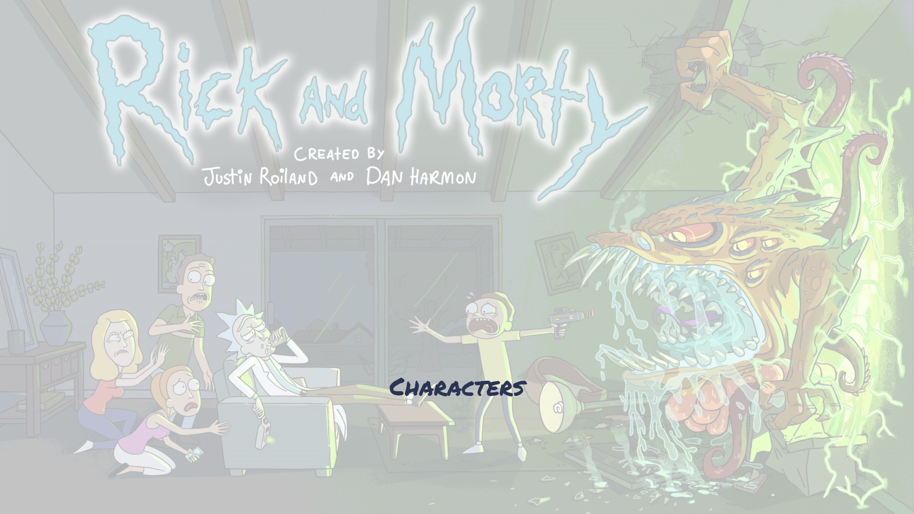

# Rick and Morty

> Rick and Morty Characters Web Page.



Single Page Application that uses Rick and Morty API along with React & Redux. You find information about characters in the following project.

## Built With

- JavaScript, CSS
- React, Redux
- NPM, Developer Tools

## Live Demo

[Live Demo Link](https://rickandmortyandorcun.netlify.app/)
[Loom Link](https://www.loom.com/share/8ba9509fc094404cbc624c6750de8955)


## Getting Started

To get a local copy up and running follow these simple example steps.

- Clone the project:

```
git clone https://github.com/luftedar/rickandmorty.git
```

- cd into the folder

```
cd rickandmorty
```

- Install NPM

```
npm install
```

- Open with a code editor

```
code .
```

- Start local server

```
npm start
```

- For testing

```
npm run test
```

### Prerequisites

- Text Editor
- Web Browser
- NPM

## Authors

👤 **Orçun Uğur**

- GitHub: [@githubhandle](https://github.com/luftedar)
- LinkedIn: [LinkedIn](https://www.linkedin.com/in/orcunugur)

## 🤝 Contributing

Contributions, issues, and feature requests are welcome!

Feel free to check the [issues page](../../issues/).

## Show your support

Give a ⭐️ if you like this project!

## Acknowledgments

- This project is the Microverse's third module's capstone project
- Thanks to [Nelson Sakwa](https://www.behance.net/sakwadesignstudio) who is author of the original design.

## 📝 License

This project is [MIT](./MIT.md) licensed.
